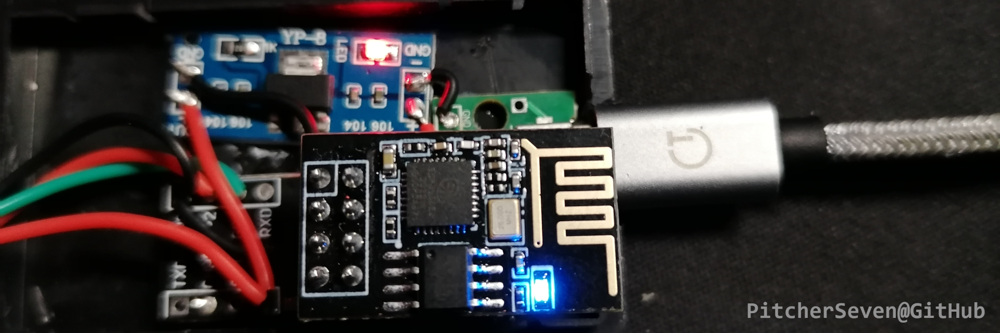
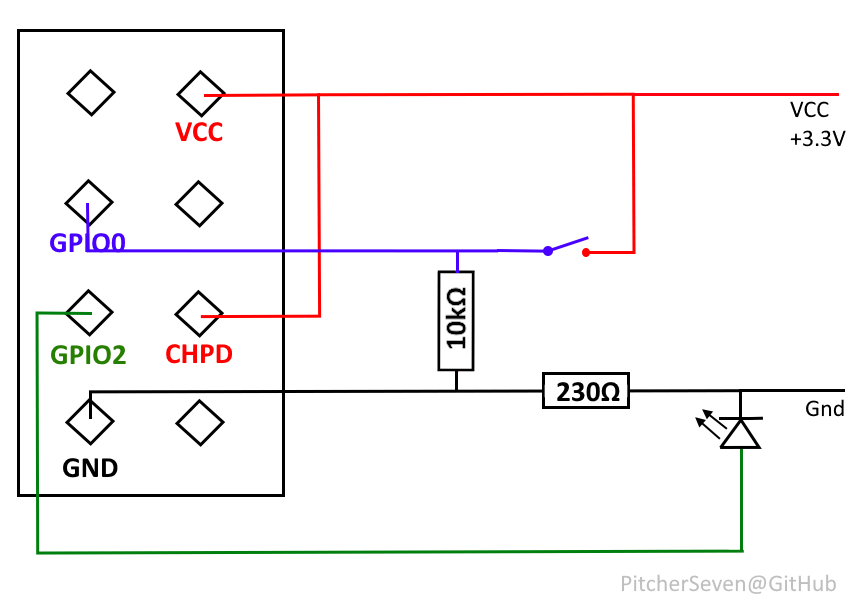

# ESP-01 based IoT button

## Purpose

The project idea came up, when I was too lazzy to click around in my local web page. On push, the button connects to local WiFi and blinks while connecting. On connection, it makes an local API call, which is not further described here nor part of the project.

The project is here to get you getting started with _your_ project idea. This repository is about wiring and providing a template class, that handles basic logic like connection, blinking and reaction to button push. 

## Wiring

### Requirements

* Technical training or knowledge strictly recommended

* Commonly used, generic LED

* 230Ω resistor

* 10kΩ resistor

* Wiring material

The wiring is quite simple. We pull-down the button pin _0_ using a 10kΩ while not being pushed. When being pushed, the pin gets connected to +3.3V, setting it to GPIO status _HIGH_, protected from being shortended harmful by resistor.

The LED is connected to GPIO _2_ and to ground using the 230Ω resistor. By programmatically setting GPIO _2_ to HIGH, the LED is powered with +3.3V closing the circuit.

Please note that _CHPD_ is pulled HIGH in order to start the device gracefully in production.  

The source for _VCC 3.3V_ needs to be implemented externally. I used a not further described step-down for that. In order to prevent missinformation, I won't handle the power source inside this project and leave this up to you. 

## Programming

The provided [sketch](Button_Sketch) is a template for your actions, when button is pushed. It has global varibles configuring WiFi connection and variables used to handle button push logic.

While being idle, the program only reads GPIO _0_ over and over again. When a button push is detected after pre-configured delay _buttonChangeDelay_, the action method **button_pressed** is called. This method connects then to WiFi and runs the target actions, that needs to be implemented by you. 

The program responds to a push, when pin was set HIGH for over _buttonChangeDelay_(50ms). If you encounter problems with that, you can either increase or decrease this delay.

## DISCLAIMER

YOU AS A PERSON ARE RESPONSIBLE, WHEN WORKING WITH ELECTRONIC DEVICES, INCLUDING SOLDERING DEVICES, ELECTRONIC VOLTAGES AND ELECTRONICAL CURRENTS. THE PROJECT MAINTAINERS ARE NOT RESPONSIBLE OR LIABLE FOR WRONG OR CHANGED INFORMATION, INAPPROPIATE WORKING MATERIAL, DAMAGES ON YOUR ESP-01 DEVICES OR INJURIES ON YOUR WORK-SIDE.
ALSO THE PROJECT MAINTAINERS ARE NOT RESPONSIBLE OR LIABLE FOR PIN-LAYOUT CHANGES BY ESP-01 VENDORS, MAY MAKING THE SHOWN WIRING HARMFUL FOR YOU OR THE DEVICE ITSELF.

"ESP-01" IS A PRODUCT OWNED BY [Espressif Systems](https://github.com/espressif). THIS PROJECT IS USING THIS MODULE WITHOUT BEING RELATED TO THIS TRADEMARK OR COMPANY.